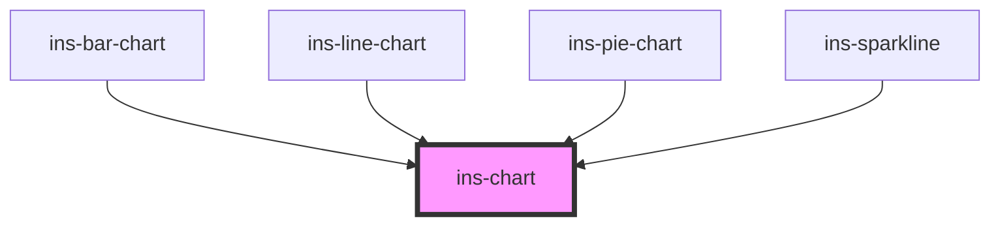

# ins-chart

<!-- Auto Generated Below -->

## Methods

### `generateColor(color: string, count: number) => Promise<Highcharts.ColorType>`

#### Parameters

| Name    | Type     | Description |
| ------- | -------- | ----------- |
| `color` | `string` |             |
| `count` | `number` |             |

#### Returns

Type: `Promise<ColorType>`

### `renderChart(options: Highcharts.Options) => Promise<void>`

#### Parameters

| Name      | Type      | Description |
| --------- | --------- | ----------- |
| `options` | `Options` |             |

#### Returns

Type: `Promise<void>`

## Dependencies

### Used by

 - [ins-bar-chart](../ins-bar-chart)
 - [ins-line-chart](../ins-line-chart)
 - [ins-pie-chart](../ins-pie-chart)
 - [ins-sparkline](../ins-sparkline)

### Graph

----------------------------------------------

*Built with [StencilJS](https://stenciljs.com/)*
