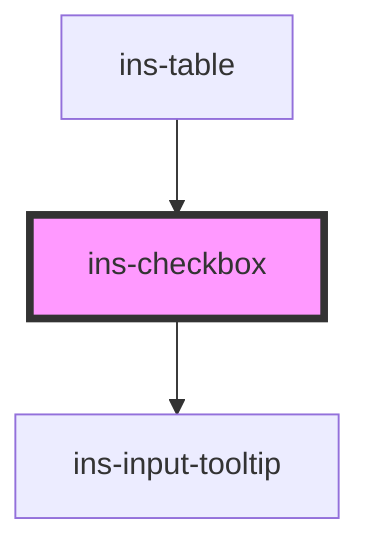

# ins-checkbox

<!-- Auto Generated Below -->

## Properties

| Property     | Attribute     | Description | Type      | Default     |
| ------------ | ------------- | ----------- | --------- | ----------- |
| `checkLoad`  | `check-load`  |             | `boolean` | `false`     |
| `checked`    | `checked`     |             | `boolean` | `undefined` |
| `disabled`   | `disabled`    |             | `boolean` | `undefined` |
| `falseValue` | `false-value` |             | `string`  | `""`        |
| `hasLoad`    | `has-load`    |             | `string`  | `undefined` |
| `label`      | `label`       |             | `string`  | `undefined` |
| `load`       | `load`        |             | `boolean` | `false`     |
| `name`       | `name`        |             | `string`  | `""`        |
| `tooltip`    | `tooltip`     |             | `string`  | `""`        |
| `trueValue`  | `true-value`  |             | `string`  | `""`        |
| `value`      | `value`       |             | `string`  | `undefined` |

## Events

| Event            | Description | Type               |
| ---------------- | ----------- | ------------------ |
| `didLoad`        |             | `CustomEvent<any>` |
| `insCheck`       |             | `CustomEvent<any>` |
| `insValueChange` |             | `CustomEvent<any>` |

## Methods

### `getValue() => Promise<{ value: string; trueValue: string; falseValue: string; }>`

#### Returns

Type: `Promise<{ value: string; trueValue: string; falseValue: string; }>`

### `setValue(value: string, trueValue: string, falseValue: string) => Promise<void>`

#### Parameters

| Name         | Type     | Description |
| ------------ | -------- | ----------- |
| `value`      | `string` |             |
| `trueValue`  | `string` |             |
| `falseValue` | `string` |             |

#### Returns

Type: `Promise<void>`

### `updateCheckState(state: boolean) => Promise<void>`

#### Parameters

| Name    | Type      | Description |
| ------- | --------- | ----------- |
| `state` | `boolean` |             |

#### Returns

Type: `Promise<void>`

## Dependencies

### Used by

 - [ins-table](../ins-table)

### Depends on

- [ins-input-tooltip](../ins-input-tooltip)

### Graph

----------------------------------------------

*Built with [StencilJS](https://stenciljs.com/)*
