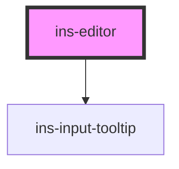

# ins-editor

<!-- Auto Generated Below -->

## Properties

| Property             | Attribute              | Description | Type      | Default                                                |
| -------------------- | ---------------------- | ----------- | --------- | ------------------------------------------------------ |
| `blankValues`        | `blank-values`         |             | `boolean` | `false`                                                |
| `checkLoad`          | `check-load`           |             | `boolean` | `false`                                                |
| `checkValue`         | `check-value`          |             | `boolean` | `false`                                                |
| `classId`            | `class-id`             |             | `string`  | `""`                                                   |
| `description`        | `description`          |             | `string`  | `""`                                                   |
| `disableLineNumbers` | `disable-line-numbers` |             | `boolean` | `false`                                                |
| `errorMessage`       | `error-message`        |             | `string`  | `""`                                                   |
| `hasCodeEditor`      | `has-code-editor`      |             | `boolean` | `false`                                                |
| `hasError`           | `has-error`            |             | `boolean` | `false`                                                |
| `htmlDescription`    | `html-description`     |             | `boolean` | `false`                                                |
| `imageUpload`        | `image-upload`         |             | `boolean` | `false`                                                |
| `images`             | `images`               |             | `string`  | `""`                                                   |
| `label`              | `label`                |             | `string`  | `""`                                                   |
| `load`               | `load`                 |             | `boolean` | `false`                                                |
| `mode`               | `mode`                 |             | `string`  | `"htmlmixed"`                                          |
| `name`               | `name`                 |             | `string`  | `""`                                                   |
| `pluginsList`        | `plugins-list`         |             | `any`     | `['alignment', 'table', 'imagemanager', 'fullscreen']` |
| `readonly`           | `readonly`             |             | `boolean` | `false`                                                |
| `showSource`         | `show-source`          |             | `boolean` | `false`                                                |
| `theme`              | `theme`                |             | `string`  | `""`                                                   |
| `tooltip`            | `tooltip`              |             | `string`  | `""`                                                   |
| `value`              | `value`                |             | `string`  | `""`                                                   |

## Events

| Event            | Description | Type                  |
| ---------------- | ----------- | --------------------- |
| `insBlur`        |             | `CustomEvent<string>` |
| `insInput`       |             | `CustomEvent<string>` |
| `insUpload`      |             | `CustomEvent<any>`    |
| `insValueChange` |             | `CustomEvent<string>` |

## Methods

### `getValue() => Promise<string>`

#### Returns

Type: `Promise<string>`

### `insRecover() => Promise<void>`

#### Returns

Type: `Promise<void>`

### `insReset() => Promise<void>`

#### Returns

Type: `Promise<void>`

### `setValue(value: string) => Promise<void>`

#### Parameters

| Name    | Type     | Description |
| ------- | -------- | ----------- |
| `value` | `string` |             |

#### Returns

Type: `Promise<void>`

### `val() => Promise<string>`

#### Returns

Type: `Promise<string>`

## Dependencies

### Depends on

- [ins-input-tooltip](../ins-input-tooltip)

### Graph

----------------------------------------------

*Built with [StencilJS](https://stenciljs.com/)*
