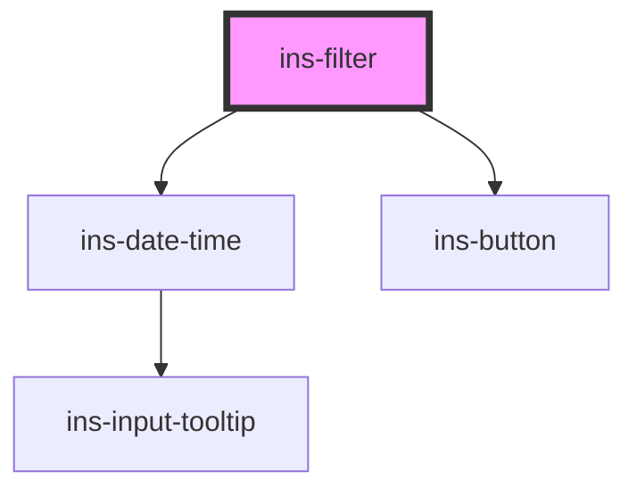

# ins-filter

<!-- Auto Generated Below -->

## Properties

| Property         | Attribute          | Description | Type      | Default                                                                                                                                              |
| ---------------- | ------------------ | ----------- | --------- | ---------------------------------------------------------------------------------------------------------------------------------------------------- |
| `checkLoad`      | `check-load`       |             | `boolean` | `false`                                                                                                                                              |
| `dateFormat`     | `date-format`      |             | `string`  | `"YYYY-MM-DD"`                                                                                                                                       |
| `dateFrom`       | `date-from`        |             | `string`  | `""`                                                                                                                                                 |
| `dateOpt`        | `date-opt`         |             | `any`     | `[     'All',     'Today',     'This Week',     'Last Week',     'This Month',     'Last Month',     'This Year',     'Last Year',     'Custom'   ]` |
| `dateTitle`      | `date-title`       |             | `any`     | `"Date Period"`                                                                                                                                      |
| `dateTo`         | `date-to`          |             | `string`  | `""`                                                                                                                                                 |
| `defaultDate`    | `default-date`     |             | `string`  | `""`                                                                                                                                                 |
| `hasLoad`        | `has-load`         |             | `string`  | `undefined`                                                                                                                                          |
| `label`          | `label`            |             | `string`  | `"Filter:"`                                                                                                                                          |
| `load`           | `load`             |             | `boolean` | `false`                                                                                                                                              |
| `withDateFilter` | `with-date-filter` |             | `boolean` | `false`                                                                                                                                              |

## Events

| Event            | Description | Type                                 |
| ---------------- | ----------- | ------------------------------------ |
| `didLoad`        |             | `CustomEvent<any>`                   |
| `insFilterApply` |             | `CustomEvent<{ [x: string]: any; }>` |

## Methods

### `closeDateFilter() => Promise<void>`

#### Returns

Type: `Promise<void>`

### `getDate() => Promise<"All" | { from: string; to: string; }>`

#### Returns

Type: `Promise<"All" | { from: string; to: string; }>`

## Dependencies

### Depends on

- [ins-date-time](../ins-date-time)
- [ins-button](../ins-button)

### Graph

----------------------------------------------

*Built with [StencilJS](https://stenciljs.com/)*
