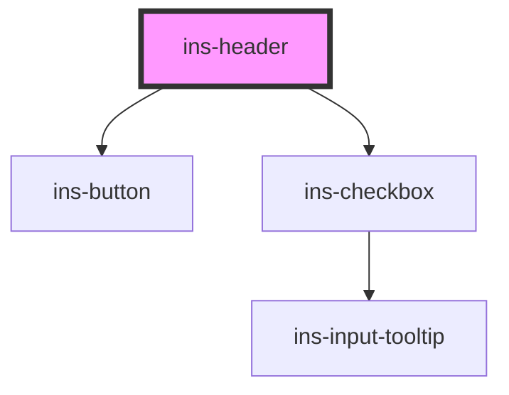

# ins-header

The admin top bar. Owns `toggleSidebar()`, which flips `body.mini` and calls the rail's
`minimise()`/`maximise()`; both `ins-sidebar-item` and the module's admin script call it, so its
contract is stable.

## Default rendering

Unchanged from the original: burger, fullscreen, optional support and notification buttons, and a
slot.

## v6 variant (IIA Admin Shell v1.5, opt-in)

`variant="v6"` renders the Admin Shell v1.5 top bar (TW#26371963): 56px `--ins-chrome-bg` on a
`1fr minmax(200px,480px) 1fr` grid (`auto 1fr` below 768px). Left: rail toggle and logo. Centre:
the support pill ("Ask us anything", presence dot, unread badge). Right: environment chip opening
the instance switcher, view-frontend, theme toggle, help menu and account menu. Only one header
popover is open at a time; Escape closes it; `[` toggles the rail; `?` opens the keyboard-shortcuts
dialog. Tooltips use the shared `data-tip` mechanism with the design's 150ms hover delay, instant
hide, and suppression once the trigger is clicked. Beneath the bar, a 40px breadcrumb bar follows
`ins-renderer`'s `insRouteChange` and hides on the dashboard.

Below 1280px the rail is a 64px column and an expanded rail is a drawer over the content. The header
keeps the desktop expanded/collapsed preference apart from the drawer: crossing into that range
collapses the rail, crossing back restores whatever the user last chose at desktop width, and toggles
made inside the range only open or close the drawer.

The theme toggle stamps `data-theme` on the document and the renderer iframe, then POSTs
`{ theme }` to `theme-endpoint` with the CSRF token from `meta[name=csrf-token]`, which is what the
previous hand-rolled header did. The switcher renders `instances` (JSON `[{id,name,env,domain}]`)
grouped Production then Staging with a check dot on `instance-id`; absent a roster it shows the
current instance alone, built from `instance-name`, `instance-domain` and `environment`. Switching
is presentational until Console exposes an instance list: choosing a production target opens the
confirmation, and confirming emits `insInstanceSwitch` without navigating.

```html
<ins-header variant="v6"
  logo-src="/assets/logo-white.svg"
  environment="staging" instance-name="Acme Staging" instance-domain="acme.staging-insites.io"
  user-name="Jane Doe" user-email="jane@acme.example"
  theme-endpoint="/insites/core/themes" lock-endpoint="/api/sessions">
</ins-header>
```

<!-- Auto Generated Below -->


## Overview

IIA v6 shell header (TW#26371963) is an ADDITIVE variant of this component.

`variant="v6"` renders the Admin Shell v1.5 top bar: 56px dark chrome carrying the
rail toggle, logo, the support pill, the environment chip with the instance
switcher, view-frontend, theme toggle, help menu and account menu, plus the 40px
breadcrumb bar beneath it, the keyboard-shortcuts dialog and the production
confirmation. The default render is unchanged. `toggleSidebar()` keeps its
contract because adminScripts and ins-sidebar-item both call it.

The instance switcher is presentational this release: the roster comes from
`instances` (JSON) or, absent that, the single current instance built from the
instance-* attributes. There is no Console endpoint that lists a user's
instances yet, so Switch emits `insInstanceSwitch` and navigates nowhere.

Tooltips use the shared `data-tip` mechanism rather than a nested component; the
design's 150ms delay / instant hide / suppress-after-click live in CSS on the
`iia-hdr` scope.

## Properties

| Property              | Attribute               | Description                                                                            | Type      | Default                             |
| --------------------- | ----------------------- | -------------------------------------------------------------------------------------- | --------- | ----------------------------------- |
| `checkLoad`           | `check-load`            |                                                                                        | `boolean` | `false`                             |
| `consoleHref`         | `console-href`          |                                                                                        | `string`  | `'https://console.insites.io/'`     |
| `docsHref`            | `docs-href`             |                                                                                        | `string`  | `'https://docs.insites.io/'`        |
| `environment`         | `environment`           | 'staging' \| 'production' — this instance's tier.                                      | `string`  | `'staging'`                         |
| `frontendHref`        | `frontend-href`         |                                                                                        | `string`  | `'/'`                               |
| `hasLoad`             | `has-load`              |                                                                                        | `string`  | `undefined`                         |
| `hasMenuToggle`       | `has-menu-toggle`       |                                                                                        | `boolean` | `true`                              |
| `helpPanelsDismissed` | `help-panels-dismissed` | Whether help panels are currently dismissed (restore row is actionable).               | `boolean` | `false`                             |
| `helpRestore`         | `help-restore`          | Show the "Show help panels" restore row in the account menu.                           | `boolean` | `true`                              |
| `homeHref`            | `home-href`             |                                                                                        | `string`  | `'#/'`                              |
| `instanceDomain`      | `instance-domain`       |                                                                                        | `string`  | `''`                                |
| `instanceId`          | `instance-id`           |                                                                                        | `string`  | `'current'`                         |
| `instanceName`        | `instance-name`         |                                                                                        | `string`  | `''`                                |
| `instances`           | `instances`             | Optional JSON roster: [{ id, name, env, domain }]. Absent: the current instance alone. | `string`  | `''`                                |
| `load`                | `load`                  |                                                                                        | `boolean` | `false`                             |
| `lockEndpoint`        | `lock-endpoint`         |                                                                                        | `string`  | `'/api/sessions'`                   |
| `lockFormName`        | `lock-form-name`        |                                                                                        | `string`  | `'modules/insites_core/lock_admin'` |
| `logoAlt`             | `logo-alt`              |                                                                                        | `string`  | `'Insites'`                         |
| `logoSrc`             | `logo-src`              |                                                                                        | `string`  | `''`                                |
| `logoutHref`          | `logout-href`           |                                                                                        | `string`  | `'/admin/sessions/logout'`          |
| `profileHref`         | `profile-href`          |                                                                                        | `string`  | `'#/my-profile'`                    |
| `supportLink`         | `support-link`          |                                                                                        | `string`  | `undefined`                         |
| `supportPresence`     | `support-presence`      | Presence label on the support pill.                                                    | `string`  | `'Online'`                          |
| `supportReplyLine`    | `support-reply-line`    |                                                                                        | `string`  | `'Replies in ~2h'`                  |
| `themeEndpoint`       | `theme-endpoint`        |                                                                                        | `string`  | `'/insites/core/themes'`            |
| `userEmail`           | `user-email`            |                                                                                        | `string`  | `''`                                |
| `userName`            | `user-name`             |                                                                                        | `string`  | `''`                                |
| `variant`             | `variant`               | '' keeps the original rendering. 'v6' is the Admin Shell v1.5 header.                  | `string`  | `''`                                |


## Events

| Event               | Description | Type                                                      |
| ------------------- | ----------- | --------------------------------------------------------- |
| `didLoad`           |             | `CustomEvent<any>`                                        |
| `insHelpRestore`    |             | `CustomEvent<void>`                                       |
| `insInstanceSwitch` |             | `CustomEvent<{ from: string; to: string; env: string; }>` |
| `insLockScreen`     |             | `CustomEvent<void>`                                       |
| `insShortcutsOpen`  |             | `CustomEvent<void>`                                       |
| `insSupportOpen`    |             | `CustomEvent<void>`                                       |
| `insThemeChange`    |             | `CustomEvent<{ theme: string; }>`                         |


## Methods

### `toggleNav() => Promise<void>`


#### Returns

Type: `Promise<void>`


### `toggleSidebar() => Promise<void>`


#### Returns

Type: `Promise<void>`


## Dependencies

### Depends on

- [ins-button](../ins-button)
- [ins-checkbox](../ins-checkbox)

### Graph


----------------------------------------------

*Built with [StencilJS](https://stenciljs.com/)*
