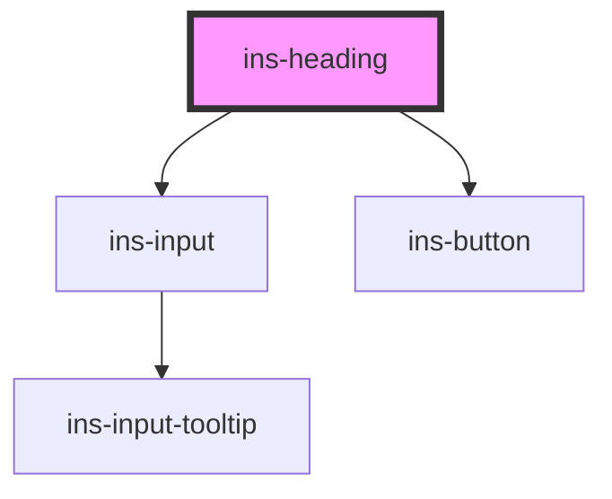

# ins-heading

<!-- Auto Generated Below -->

## Properties

| Property          | Attribute          | Description | Type      | Default     |
| ----------------- | ------------------ | ----------- | --------- | ----------- |
| `backgroundColor` | `background-color` |             | `string`  | `'#fff'`    |
| `change`          | `change`           |             | `string`  | `""`        |
| `checkLoad`       | `check-load`       |             | `boolean` | `false`     |
| `editable`        | `editable`         |             | `boolean` | `false`     |
| `hasLoad`         | `has-load`         |             | `string`  | `undefined` |
| `label`           | `label`            |             | `string`  | `""`        |
| `level`           | `level`            |             | `number`  | `6`         |
| `load`            | `load`             |             | `boolean` | `false`     |
| `maxlength`       | `maxlength`        |             | `string`  | `""`        |
| `name`            | `name`             |             | `string`  | `""`        |
| `withoutLine`     | `without-line`     |             | `boolean` | `false`     |

## Events

| Event       | Description | Type                                                                   |
| ----------- | ----------- | ---------------------------------------------------------------------- |
| `didLoad`   |             | `CustomEvent<any>`                                                     |
| `insChange` |             | `CustomEvent<{ name: string; old_label: string; new_label: string; }>` |

## Dependencies

### Depends on

- [ins-input](../ins-input)
- [ins-button](../ins-button)

### Graph

----------------------------------------------

*Built with [StencilJS](https://stenciljs.com/)*
