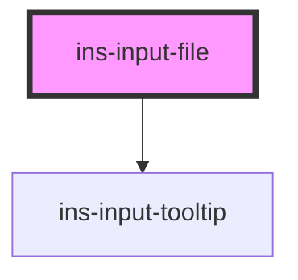

# ins-input-file

<!-- Auto Generated Below -->

## Properties

| Property            | Attribute             | Description | Type      | Default                               |
| ------------------- | --------------------- | ----------- | --------- | ------------------------------------- |
| `acceptedFiles`     | `accepted-files`      |             | `string`  | `null`                                |
| `autoUpload`        | `auto-upload`         |             | `boolean` | `false`                               |
| `capture`           | `capture`             |             | `string`  | `null`                                |
| `checkLoad`         | `check-load`          |             | `boolean` | `false`                               |
| `checkValue`        | `check-value`         |             | `boolean` | `false`                               |
| `credentialsUrl`    | `credentials-url`     |             | `string`  | `undefined`                           |
| `description`       | `description`         |             | `string`  | `""`                                  |
| `disabled`          | `disabled`            |             | `boolean` | `false`                               |
| `errorMessage`      | `error-message`       |             | `string`  | `""`                                  |
| `fieldName`         | `field-name`          |             | `string`  | `undefined`                           |
| `fieldType`         | `field-type`          |             | `string`  | `"image"`                             |
| `fileIcon`          | `file-icon`           |             | `string`  | `"icon-notepad"`                      |
| `hasError`          | `has-error`           |             | `boolean` | `false`                               |
| `hasLoad`           | `has-load`            |             | `string`  | `undefined`                           |
| `htmlDescription`   | `html-description`    |             | `boolean` | `false`                               |
| `label`             | `label`               |             | `string`  | `"Attachment(s)"`                     |
| `load`              | `load`                |             | `boolean` | `false`                               |
| `maxFileSize`       | `max-file-size`       |             | `number`  | `10`                                  |
| `maxFileSizeLabel`  | `max-file-size-label` |             | `string`  | `"Max file size"`                     |
| `maxFiles`          | `max-files`           |             | `number`  | `1`                                   |
| `maxFilesLabel`     | `max-files-label`     |             | `string`  | `"Up to"`                             |
| `name`              | `name`                |             | `string`  | `"file"`                              |
| `placeholder`       | `placeholder`         |             | `string`  | `"Drop file here or click to upload"` |
| `required`          | `required`            |             | `boolean` | `false`                               |
| `s3Data`            | --                    |             | `object`  | `undefined`                           |
| `showLimit`         | `show-limit`          |             | `boolean` | `true`                                |
| `showNotifications` | `show-notifications`  |             | `boolean` | `true`                                |
| `subtext`           | `subtext`             |             | `string`  | `""`                                  |
| `tooltip`           | `tooltip`             |             | `string`  | `""`                                  |
| `typeLabel`         | `type-label`          |             | `string`  | `"file"`                              |
| `value`             | `value`               |             | `any`     | `[]`                                  |

## Events

| Event             | Description | Type               |
| ----------------- | ----------- | ------------------ |
| `didLoad`         |             | `CustomEvent<any>` |
| `insFileAdded`    |             | `CustomEvent<any>` |
| `insFileChange`   |             | `CustomEvent<any>` |
| `insFileError`    |             | `CustomEvent<any>` |
| `insFileRemoved`  |             | `CustomEvent<any>` |
| `insFileUploaded` |             | `CustomEvent<any>` |

## Methods

### `buildFormData(s3Data: any, formData: FormData) => Promise<void>`

#### Parameters

| Name       | Type       | Description |
| ---------- | ---------- | ----------- |
| `s3Data`   | `any`      |             |
| `formData` | `FormData` |             |

#### Returns

Type: `Promise<void>`

### `getDropzoneInstance() => Promise<any>`

#### Returns

Type: `Promise<any>`

### `getFilesList() => Promise<any>`

#### Returns

Type: `Promise<any>`

### `getS3Credentials() => Promise<object>`

#### Returns

Type: `Promise<object>`

### `getUploadingFiles() => Promise<any>`

#### Returns

Type: `Promise<any>`

### `insRecover() => Promise<void>`

#### Returns

Type: `Promise<void>`

### `insReset() => Promise<void>`

#### Returns

Type: `Promise<void>`

### `processS3AutoUpload(file: any) => Promise<void>`

#### Parameters

| Name   | Type  | Description |
| ------ | ----- | ----------- |
| `file` | `any` |             |

#### Returns

Type: `Promise<void>`

### `removeFiles() => Promise<void>`

#### Returns

Type: `Promise<void>`

### `setFiles(files: any) => Promise<boolean>`

#### Parameters

| Name    | Type  | Description |
| ------- | ----- | ----------- |
| `files` | `any` |             |

#### Returns

Type: `Promise<boolean>`

### `setS3FormData() => Promise<void>`

#### Returns

Type: `Promise<void>`

### `trigger() => Promise<void>`

#### Returns

Type: `Promise<void>`

### `uploadErrorNotification() => Promise<void>`

#### Returns

Type: `Promise<void>`

## Dependencies

### Depends on

- [ins-input-tooltip](../ins-input-tooltip)

### Graph

----------------------------------------------

*Built with [StencilJS](https://stenciljs.com/)*
