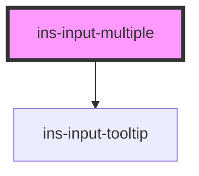

# ins-input-multiple

<!-- Auto Generated Below -->

## Properties

| Property          | Attribute          | Description | Type      | Default     |
| ----------------- | ------------------ | ----------- | --------- | ----------- |
| `checkLoad`       | `check-load`       |             | `boolean` | `false`     |
| `checkValue`      | `check-value`      |             | `boolean` | `false`     |
| `description`     | `description`      |             | `string`  | `""`        |
| `disabled`        | `disabled`         |             | `boolean` | `false`     |
| `errorMessage`    | `error-message`    |             | `string`  | `""`        |
| `hasError`        | `has-error`        |             | `boolean` | `false`     |
| `hasLoad`         | `has-load`         |             | `string`  | `undefined` |
| `htmlDescription` | `html-description` |             | `boolean` | `false`     |
| `label`           | `label`            |             | `string`  | `undefined` |
| `load`            | `load`             |             | `boolean` | `false`     |
| `name`            | `name`             |             | `string`  | `undefined` |
| `placeholder`     | `placeholder`      |             | `string`  | `undefined` |
| `readonly`        | `readonly`         |             | `boolean` | `false`     |
| `tooltip`         | `tooltip`          |             | `string`  | `""`        |
| `value`           | `value`            |             | `any`     | `[]`        |

## Events

| Event            | Description | Type               |
| ---------------- | ----------- | ------------------ |
| `didLoad`        |             | `CustomEvent<any>` |
| `insChange`      |             | `CustomEvent<any>` |
| `insInput`       |             | `CustomEvent<any>` |
| `insValueChange` |             | `CustomEvent<any>` |

## Methods

### `getValue() => Promise<any>`

#### Returns

Type: `Promise<any>`

### `insRecover() => Promise<void>`

#### Returns

Type: `Promise<void>`

### `insReset() => Promise<void>`

#### Returns

Type: `Promise<void>`

### `setValue(value: string | any[]) => Promise<void>`

#### Parameters

| Name    | Type              | Description |
| ------- | ----------------- | ----------- |
| `value` | `string \| any[]` |             |

#### Returns

Type: `Promise<void>`

### `val() => Promise<any>`

#### Returns

Type: `Promise<any>`

## Dependencies

### Depends on

- [ins-input-tooltip](../ins-input-tooltip)

### Graph

----------------------------------------------

*Built with [StencilJS](https://stenciljs.com/)*
