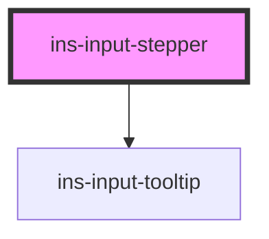

# ins-stepper

<!-- Auto Generated Below -->

## Properties

| Property              | Attribute                 | Description | Type      | Default     |
| --------------------- | ------------------------- | ----------- | --------- | ----------- |
| `checkLoad`           | `check-load`              |             | `boolean` | `false`     |
| `checkValue`          | `check-value`             |             | `boolean` | `false`     |
| `description`         | `description`             |             | `string`  | `""`        |
| `disabled`            | `disabled`                |             | `boolean` | `false`     |
| `errorMessage`        | `error-message`           |             | `string`  | `""`        |
| `hasError`            | `has-error`               |             | `boolean` | `false`     |
| `hasLoad`             | `has-load`                |             | `string`  | `undefined` |
| `htmlDescription`     | `html-description`        |             | `boolean` | `false`     |
| `label`               | `label`                   |             | `string`  | `""`        |
| `load`                | `load`                    |             | `boolean` | `false`     |
| `max`                 | `max`                     |             | `string`  | `undefined` |
| `min`                 | `min`                     |             | `string`  | `undefined` |
| `name`                | `name`                    |             | `string`  | `""`        |
| `noValueChangeOnBlur` | `no-value-change-on-blur` |             | `boolean` | `false`     |
| `readonly`            | `readonly`                |             | `boolean` | `false`     |
| `required`            | `required`                |             | `boolean` | `false`     |
| `step`                | `step`                    |             | `string`  | `"1"`       |
| `tooltip`             | `tooltip`                 |             | `string`  | `""`        |
| `value`               | `value`                   |             | `string`  | `undefined` |

## Events

| Event            | Description | Type               |
| ---------------- | ----------- | ------------------ |
| `didLoad`        |             | `CustomEvent<any>` |
| `insBlur`        |             | `CustomEvent<any>` |
| `insValueChange` |             | `CustomEvent<any>` |

## Methods

### `getValue() => Promise<number>`

#### Returns

Type: `Promise<number>`

### `insRecover() => Promise<void>`

#### Returns

Type: `Promise<void>`

### `insReset() => Promise<void>`

#### Returns

Type: `Promise<void>`

### `setValue(value: string) => Promise<void>`

#### Parameters

| Name    | Type     | Description |
| ------- | -------- | ----------- |
| `value` | `string` |             |

#### Returns

Type: `Promise<void>`

## Dependencies

### Depends on

- [ins-input-tooltip](../ins-input-tooltip)

### Graph

----------------------------------------------

*Built with [StencilJS](https://stenciljs.com/)*
