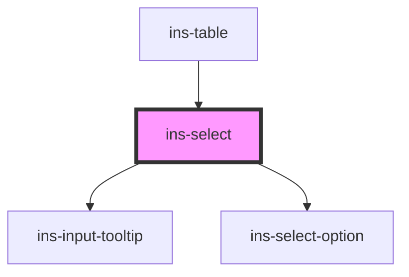

# ins-select

<!-- Auto Generated Below -->

## Properties

| Property                    | Attribute                      | Description | Type      | Default     |
| --------------------------- | ------------------------------ | ----------- | --------- | ----------- |
| `button`                    | `button`                       |             | `boolean` | `false`     |
| `buttonLabel`               | `button-label`                 |             | `string`  | `"Add"`     |
| `checkLoad`                 | `check-load`                   |             | `boolean` | `false`     |
| `description`               | `description`                  |             | `string`  | `""`        |
| `disabled`                  | `disabled`                     |             | `boolean` | `false`     |
| `dynamicErrorMessage`       | `dynamic-error-message`        |             | `string`  | `""`        |
| `dynamicHasError`           | `dynamic-has-error`            |             | `boolean` | `false`     |
| `dynamicPlaceholder`        | `dynamic-placeholder`          |             | `string`  | `undefined` |
| `dynamicSearch`             | `dynamic-search`               |             | `boolean` | `false`     |
| `errorMessage`              | `error-message`                |             | `string`  | `""`        |
| `hasError`                  | `has-error`                    |             | `boolean` | `false`     |
| `hasLoad`                   | `has-load`                     |             | `string`  | `undefined` |
| `htmlDescription`           | `html-description`             |             | `boolean` | `false`     |
| `infiniteScroll`            | `infinite-scroll`              |             | `boolean` | `false`     |
| `initializing`              | `initializing`                 |             | `boolean` | `false`     |
| `label`                     | `label`                        |             | `string`  | `undefined` |
| `labelKey`                  | `label-key`                    |             | `string`  | `""`        |
| `load`                      | `load`                         |             | `boolean` | `false`     |
| `multiple`                  | `multiple`                     |             | `boolean` | `false`     |
| `name`                      | `name`                         |             | `string`  | `undefined` |
| `optionsData`               | --                             |             | `any[]`   | `[]`        |
| `placeholder`               | `placeholder`                  |             | `string`  | `""`        |
| `readonly`                  | `readonly`                     |             | `boolean` | `false`     |
| `searchPlaceholder`         | `search-placeholder`           |             | `string`  | `""`        |
| `searchable`                | `searchable`                   |             | `boolean` | `false`     |
| `selected_values`           | `selected_values`              |             | `any`     | `[]`        |
| `small`                     | `small`                        |             | `boolean` | `false`     |
| `tooltip`                   | `tooltip`                      |             | `string`  | `""`        |
| `value`                     | `value`                        |             | `any`     | `undefined` |
| `valueKey`                  | `value-key`                    |             | `string`  | `""`        |
| `withDynamicOption`         | `with-dynamic-option`          |             | `boolean` | `false`     |
| `withDynamicOptionValidate` | `with-dynamic-option-validate` |             | `boolean` | `false`     |

## Events

| Event             | Description | Type                                                                                                       |
| ----------------- | ----------- | ---------------------------------------------------------------------------------------------------------- |
| `didLoad`         |             | `CustomEvent<void>`                                                                                        |
| `insClose`        |             | `CustomEvent<void>`                                                                                        |
| `insLoadMore`     |             | `CustomEvent<void>`                                                                                        |
| `insOptionSelect` |             | `CustomEvent<{ event_type: string; selected: any[]; selectedOptions: { label: string; value: any; }[]; }>` |
| `insSearch`       |             | `CustomEvent<string>`                                                                                      |
| `insSubmit`       |             | `CustomEvent<string>`                                                                                      |
| `insValueChange`  |             | `CustomEvent<any>`                                                                                         |

## Methods

### `collapseSection() => Promise<void>`

#### Returns

Type: `Promise<void>`

### `disableNoResult() => Promise<boolean>`

#### Returns

Type: `Promise<boolean>`

### `enableNoResult() => Promise<boolean>`

#### Returns

Type: `Promise<boolean>`

### `expandSection() => Promise<void>`

#### Returns

Type: `Promise<void>`

### `getAllOptions() => Promise<NodeListOf<HTMLInsSelectOptionElement>>`

#### Returns

Type: `Promise<NodeListOf<HTMLInsSelectOptionElement>>`

### `getValue() => Promise<any>`

#### Returns

Type: `Promise<any>`

### `reset() => Promise<boolean>`

#### Returns

Type: `Promise<boolean>`

### `resetDynamicOption() => Promise<void>`

#### Returns

Type: `Promise<void>`

### `setInsSelectDefaultValue() => Promise<void>`

#### Returns

Type: `Promise<void>`

### `setLoadingState(state: boolean) => Promise<boolean>`

#### Parameters

| Name    | Type      | Description |
| ------- | --------- | ----------- |
| `state` | `boolean` |             |

#### Returns

Type: `Promise<boolean>`

### `setSearchingState(state: boolean) => Promise<boolean>`

#### Parameters

| Name    | Type      | Description |
| ------- | --------- | ----------- |
| `state` | `boolean` |             |

#### Returns

Type: `Promise<boolean>`

### `setSelectedFromValue(value?: any) => Promise<boolean>`

#### Parameters

| Name    | Type  | Description |
| ------- | ----- | ----------- |
| `value` | `any` |             |

#### Returns

Type: `Promise<boolean>`

### `setValue(value: any) => Promise<void>`

#### Parameters

| Name    | Type  | Description |
| ------- | ----- | ----------- |
| `value` | `any` |             |

#### Returns

Type: `Promise<void>`

### `updateSelectedOptions() => Promise<boolean>`

#### Returns

Type: `Promise<boolean>`

## Dependencies

### Used by

 - [ins-table](../ins-table)

### Depends on

- [ins-input-tooltip](../ins-input-tooltip)
- [ins-select-option](../ins-select-option)

### Graph

----------------------------------------------

*Built with [StencilJS](https://stenciljs.com/)*
