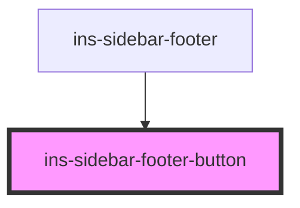

# ins-sidebar-footer-button

<!-- Auto Generated Below -->

## Properties

| Property    | Attribute    | Description | Type      | Default     |
| ----------- | ------------ | ----------- | --------- | ----------- |
| `checkLoad` | `check-load` |             | `boolean` | `false`     |
| `hasLoad`   | `has-load`   |             | `string`  | `undefined` |
| `icon`      | `icon`       |             | `string`  | `''`        |
| `load`      | `load`       |             | `boolean` | `false`     |
| `open`      | `open`       |             | `string`  | `''`        |

## Events

| Event                         | Description | Type                      |
| ----------------------------- | ----------- | ------------------------- |
| `didLoad`                     |             | `CustomEvent<void>`       |
| `insSidebarFooterButtonEvent` |             | `CustomEvent<MouseEvent>` |

## Methods

### `insSidebarFooterButtonOnClick(event: MouseEvent) => Promise<void>`

#### Parameters

| Name    | Type         | Description |
| ------- | ------------ | ----------- |
| `event` | `MouseEvent` |             |

#### Returns

Type: `Promise<void>`

## Dependencies

### Used by

 - [ins-sidebar-footer](../ins-sidebar-footer)

### Graph

----------------------------------------------

*Built with [StencilJS](https://stenciljs.com/)*
