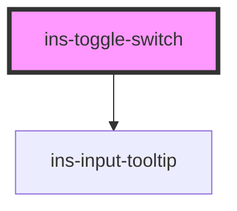

# ins-toggle-switch

<!-- Auto Generated Below -->

## Properties

| Property          | Attribute          | Description | Type      | Default     |
| ----------------- | ------------------ | ----------- | --------- | ----------- |
| `checkLoad`       | `check-load`       |             | `boolean` | `false`     |
| `checkValue`      | `check-value`      |             | `boolean` | `false`     |
| `checked`         | `checked`          |             | `boolean` | `undefined` |
| `description`     | `description`      |             | `string`  | `""`        |
| `disabled`        | `disabled`         |             | `boolean` | `undefined` |
| `disabledLabel`   | `disabled-label`   |             | `string`  | `undefined` |
| `enabledLabel`    | `enabled-label`    |             | `string`  | `undefined` |
| `errorMessage`    | `error-message`    |             | `string`  | `undefined` |
| `falseValue`      | `false-value`      |             | `string`  | `""`        |
| `hasError`        | `has-error`        |             | `boolean` | `undefined` |
| `hasLoad`         | `has-load`         |             | `string`  | `undefined` |
| `htmlDescription` | `html-description` |             | `boolean` | `false`     |
| `inputLabel`      | `input-label`      |             | `string`  | `undefined` |
| `label`           | `label`            |             | `string`  | `undefined` |
| `load`            | `load`             |             | `boolean` | `false`     |
| `name`            | `name`             |             | `string`  | `undefined` |
| `tooltip`         | `tooltip`          |             | `string`  | `""`        |
| `trueValue`       | `true-value`       |             | `string`  | `""`        |
| `value`           | `value`            |             | `string`  | `undefined` |

## Events

| Event            | Description | Type               |
| ---------------- | ----------- | ------------------ |
| `didLoad`        |             | `CustomEvent<any>` |
| `insToggle`      |             | `CustomEvent<any>` |
| `insValueChange` |             | `CustomEvent<any>` |

## Methods

### `getValue() => Promise<{ value: string; trueValue: string; falseValue: string; }>`

#### Returns

Type: `Promise<{ value: string; trueValue: string; falseValue: string; }>`

### `insRecover() => Promise<void>`

#### Returns

Type: `Promise<void>`

### `insReset() => Promise<void>`

#### Returns

Type: `Promise<void>`

### `setValue(value: string, trueValue: string, falseValue: string) => Promise<void>`

#### Parameters

| Name         | Type     | Description |
| ------------ | -------- | ----------- |
| `value`      | `string` |             |
| `trueValue`  | `string` |             |
| `falseValue` | `string` |             |

#### Returns

Type: `Promise<void>`

### `updateCheckState(state: boolean) => Promise<void>`

#### Parameters

| Name    | Type      | Description |
| ------- | --------- | ----------- |
| `state` | `boolean` |             |

#### Returns

Type: `Promise<void>`

## Dependencies

### Depends on

- [ins-input-tooltip](../ins-input-tooltip)

### Graph

----------------------------------------------

*Built with [StencilJS](https://stenciljs.com/)*
